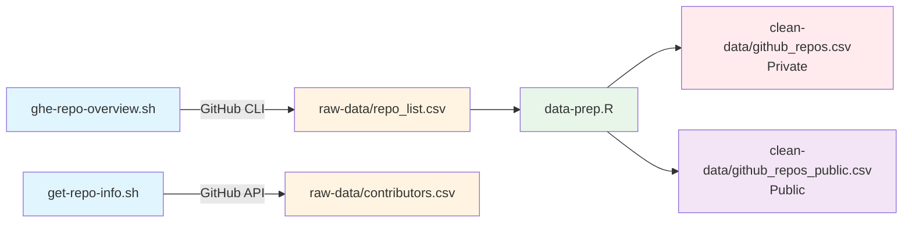
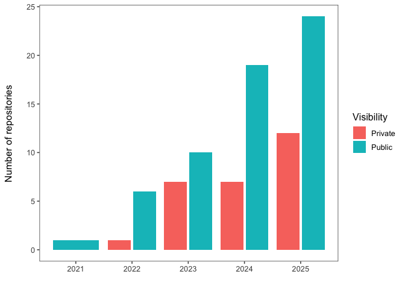
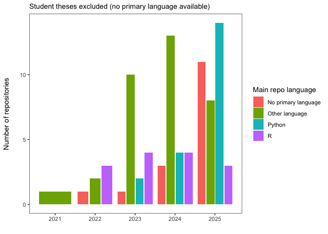
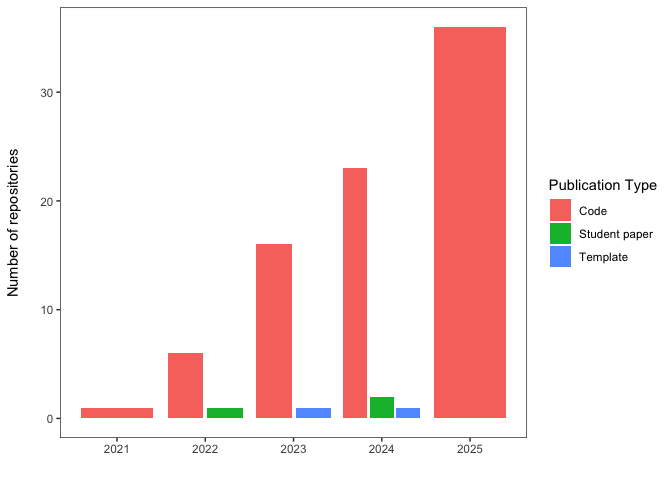
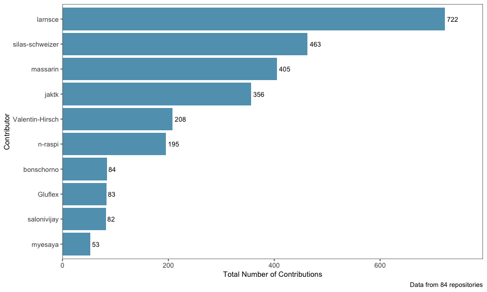
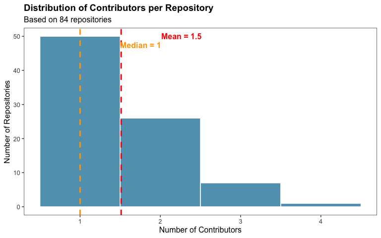
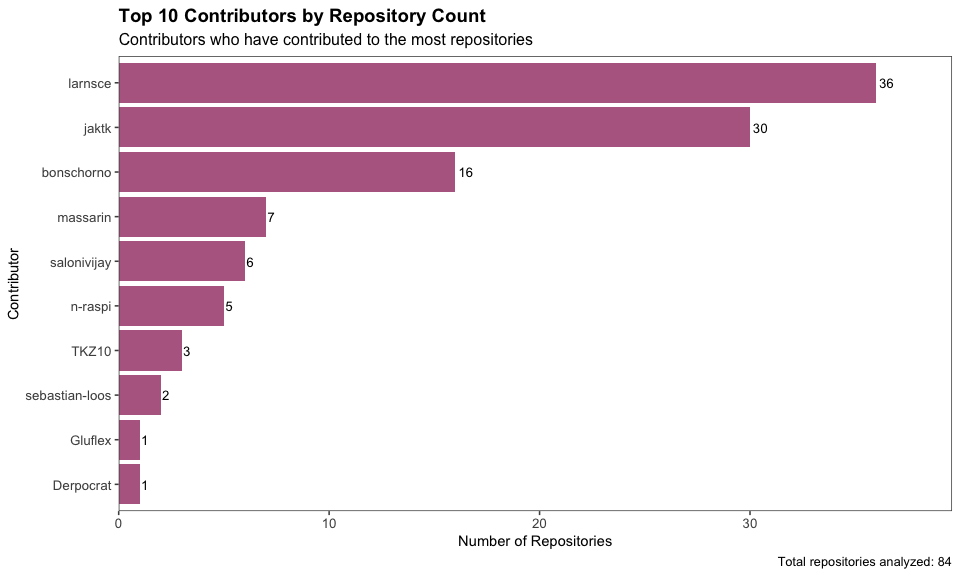
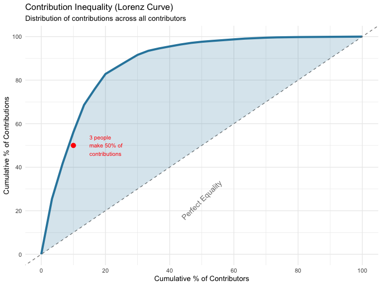

# GHE on GitHub
Global Health Engineering

At GHE, we publish most of our code on GitHub. Contributions include
code and/or data for papers, student theses, hardware, and software.

With `ghe-repo-overview.sh`, we make use of [GitHub’s
CLI](https://cli.github.com/) to fetch information on all repositories
owned by [Global Health
Engineering](https://github.com/Global-Health-Engineering), our GitHub
organization. The resulting file `repo_list.csv` is not public, however,
as it also contains information on private repositories. The second data
source, `contributors.csv`, fetched via GitHub’s API with
`get-repo-info.sh`, is not public either as it contains information on
members’ contributions. The fetched datasets are first stored in
`raw-data`, processed with `data-prep.R`, and made public in
`clean-data`.



This README must be rendered with the following command in your
terminal: `quarto render analysis.qmd --to gfm --output README.md`

<details class="code-fold">
<summary>Code</summary>

``` r
library(tidyverse)
library(scales)
library(knitr)
library(ggthemes)

# Set theme for all plots
theme_set(theme_few())
```

</details>

## Repositories

<details class="code-fold">
<summary>Code</summary>

``` r
github_repos <- read_csv("clean-data/github_repos.csv")
```

</details>

### Private/public repositories

<details class="code-fold">
<summary>Code</summary>

``` r
github_repos |>
     count(created_year, is_private) |>
     ggplot(aes(x = created_year, y = n, fill = is_private)) +
     geom_col(position = position_dodge2()) +
     labs(
          x = "",
          y = "Number of repositories\n",
          fill = "Visibility"
     ) +
     theme_few() +
     theme(panel.grid = element_blank())
```

</details>



### Licenses

<details class="code-fold">
<summary>Code</summary>

``` r
github_repos |>
     count(created_year, license_dummy) |>
     ggplot(aes(x = created_year, y = n, fill = license_dummy)) +
     geom_col(position = position_dodge2()) +
     labs(
          x = "",
          y = "Number of repositories\n",
          fill = "License?"
     ) +
     theme_few() +
     theme(panel.grid = element_blank())
```

</details>


### Main repo languages over the years

<details class="code-fold">
<summary>Code</summary>

``` r
github_repos |>
     filter(publication_type != "Student paper") |>
     count(created_year, primary_language_ext2) |>
     ggplot(aes(x = created_year, y = n, fill = primary_language_ext2)) +
     geom_col(position = position_dodge2()) +
     labs(
          x = "",
          y = "Number of repositories\n",
          fill = "Main repo language",
          subtitle = "Student theses excluded (no primary language available)"
     ) +
     theme_bw() +
     theme(panel.grid = element_blank())
```

</details>



<details class="code-fold">
<summary>Code</summary>

``` r
github_repos |>
     filter(publication_type != "Student paper") |>
     count(created_year, primary_language_ext2) |> 
  group_by(created_year) |> 
  mutate(rel_freq = n/sum(n)) |> 
  ggplot(aes(x = created_year, y = rel_freq, fill = primary_language_ext2)) +
     geom_col(position = "stack") +
  scale_y_continuous(labels = scales::label_percent()) +
  labs(y = "",
       x = "",
       fill = "Main repo language")
```

</details>


### Publication Types over the years

<details class="code-fold">
<summary>Code</summary>

``` r
github_repos |>
     count(created_year, publication_type) |>
     ggplot(aes(x = created_year, y = n, fill = publication_type)) +
     geom_col(position = position_dodge2()) +
     labs(x = "", y = "Number of repositories\n", fill = "Publication Type") +
     theme_bw() +
     theme(panel.grid = element_blank())
```

</details>



## Contributors

<details class="code-fold">
<summary>Code</summary>

``` r
contributors <- read_csv("raw-data/contributors.csv")
```

</details>

### Top contributors by total commits

<details class="code-fold">
<summary>Code</summary>

``` r
top_contributors <- contributors %>%
  group_by(login) %>%
  summarise(
    total_contributions = sum(contributions),
    repos_contributed_to = n_distinct(repository)
  ) %>%
  arrange(desc(total_contributions)) %>%
  head(10)

# Display table
kable(top_contributors, 
      caption = "Top 10 Contributors by Total Contributions",
      col.names = c("Contributor", "Total Contributions", "Repositories"))
```

</details>

| Contributor     | Total Contributions | Repositories |
|:----------------|--------------------:|-------------:|
| larnsce         |                 722 |           36 |
| silas-schweizer |                 463 |            1 |
| massarin        |                 405 |            7 |
| jaktk           |                 356 |           30 |
| Valentin-Hirsch |                 208 |            1 |
| n-raspi         |                 195 |            5 |
| bonschorno      |                  84 |           16 |
| Gluflex         |                  83 |            1 |
| salonivijay     |                  82 |            6 |
| myesaya         |                  53 |            1 |

Top 10 Contributors by Total Contributions

<details class="code-fold">
<summary>Code</summary>

``` r
ggplot(top_contributors, aes(x = reorder(login, total_contributions), 
                              y = total_contributions)) +
  geom_col(fill = "#2E86AB", alpha = 0.8) +
  geom_text(aes(label = total_contributions), 
            hjust = -0.2, 
            size = 3.5) +
  coord_flip() +
  labs(
    x = "Contributor",
    y = "Total Number of Contributions",
    caption = paste("Data from", n_distinct(contributors$repository), "repositories")
  ) +
  theme(
    plot.title = element_text(size = 14, face = "bold"),
    plot.subtitle = element_text(size = 12),
    axis.title = element_text(size = 11),
    axis.text = element_text(size = 10)
  ) +
  scale_y_continuous(expand = expansion(mult = c(0, 0.1)),
                     labels = comma)
```

</details>


### Average Number of Contributors per Repository

<details class="code-fold">
<summary>Code</summary>

``` r
repo_stats <- contributors %>%
  group_by(repository) %>%
  summarise(
    num_contributors = n_distinct(login),
    total_contributions = sum(contributions)
  )

avg_contributors <- mean(repo_stats$num_contributors)
median_contributors <- median(repo_stats$num_contributors)

# Create summary table
summary_stats <- tibble(
  Metric = c("Average Contributors per Repository", 
             "Median Contributors per Repository",
             "Total Unique Contributors",
             "Total Repositories"),
  Value = c(round(avg_contributors, 2),
            median_contributors,
            n_distinct(contributors$login),
            n_distinct(contributors$repository))
)

kable(summary_stats, caption = "Repository Contributor Statistics")
```

</details>

| Metric                              | Value |
|:------------------------------------|------:|
| Average Contributors per Repository |  1.51 |
| Median Contributors per Repository  |  1.00 |
| Total Unique Contributors           | 30.00 |
| Total Repositories                  | 84.00 |

Repository Contributor Statistics

<details class="code-fold">
<summary>Code</summary>

``` r
ggplot(repo_stats, aes(x = num_contributors)) +
  geom_histogram(binwidth = 1, fill = "#2E86AB", alpha = 0.8, color = "white") +
  geom_vline(xintercept = avg_contributors, 
             color = "red", linetype = "dashed", size = 1) +
  geom_vline(xintercept = median_contributors, 
             color = "orange", linetype = "dashed", size = 1) +
  annotate("text", x = avg_contributors + 0.5, y = Inf, 
           label = paste("Mean =", round(avg_contributors, 1)), 
           hjust = 0, vjust = 2, color = "red", fontface = "bold") +
  annotate("text", x = median_contributors + 0.5, y = Inf, 
           label = paste("Median =", median_contributors), 
           hjust = 0, vjust = 3.5, color = "orange", fontface = "bold") +
  labs(
    title = "Distribution of Contributors per Repository",
    x = "Number of Contributors",
    y = "Number of Repositories",
    subtitle = paste("Based on", n_distinct(repo_stats$repository), "repositories")
  ) +
  theme(
    plot.title = element_text(size = 14, face = "bold"),
    plot.subtitle = element_text(size = 12)
  )
```

</details>


### Contributors by Number of Repositories

<details class="code-fold">
<summary>Code</summary>

``` r
contributors_by_repos <- contributors %>%
  group_by(login) %>%
  summarise(
    num_repositories = n_distinct(repository),
    total_contributions = sum(contributions),
    avg_contributions_per_repo = round(mean(contributions), 1)
  ) %>%
  arrange(desc(num_repositories)) %>%
  head(10)

kable(contributors_by_repos,
      caption = "Top 10 Contributors by Number of Repositories",
      col.names = c("Contributor", "Repositories", "Total Contributions", "Avg per Repo"))
```

</details>

| Contributor    | Repositories | Total Contributions | Avg per Repo |
|:---------------|-------------:|--------------------:|-------------:|
| larnsce        |           36 |                 722 |         20.1 |
| jaktk          |           30 |                 356 |         11.9 |
| bonschorno     |           16 |                  84 |          5.2 |
| massarin       |            7 |                 405 |         57.9 |
| salonivijay    |            6 |                  82 |         13.7 |
| n-raspi        |            5 |                 195 |         39.0 |
| TKZ10          |            3 |                  10 |          3.3 |
| sebastian-loos |            2 |                  31 |         15.5 |
| Derpocrat      |            1 |                  15 |         15.0 |
| Gluflex        |            1 |                  83 |         83.0 |

Top 10 Contributors by Number of Repositories

<details class="code-fold">
<summary>Code</summary>

``` r
ggplot(contributors_by_repos, aes(x = reorder(login, num_repositories), 
                                   y = num_repositories)) +
  geom_col(fill = "#A23B72", alpha = 0.8) +
  geom_text(aes(label = num_repositories), 
            hjust = -0.2, 
            size = 3.5) +
  coord_flip() +
  labs(
    title = "Top 10 Contributors by Repository Count",
    subtitle = "Contributors who have contributed to the most repositories",
    x = "Contributor",
    y = "Number of Repositories",
    caption = paste("Total repositories analyzed:", n_distinct(contributors$repository))
  ) +
  theme(
    plot.title = element_text(size = 14, face = "bold"),
    plot.subtitle = element_text(size = 12),
    axis.title = element_text(size = 11),
    axis.text = element_text(size = 10)
  ) +
  scale_y_continuous(expand = expansion(mult = c(0, 0.1)))
```

</details>


### Contribution Concentration Analysis

<details class="code-fold">
<summary>Code</summary>

``` r
# Calculate cumulative contribution percentage
contribution_concentration <- contributors %>%
  group_by(login) %>%
  summarise(total_contributions = sum(contributions)) %>%
  arrange(desc(total_contributions)) %>%
  mutate(
    cumulative_contributions = cumsum(total_contributions),
    cumulative_percentage = cumulative_contributions / sum(total_contributions) * 100,
    contributor_rank = row_number()
  )

# Find how many contributors make up 50% and 80% of contributions
contributors_for_50 <- min(which(contribution_concentration$cumulative_percentage >= 50))
contributors_for_80 <- min(which(contribution_concentration$cumulative_percentage >= 80))

cat(paste("Top", contributors_for_50, "contributors (", 
          round(contributors_for_50/n_distinct(contributors$login)*100, 1), 
          "% of people) make 50% of all contributions\n"))
```

</details>

    Top 3 contributors ( 10 % of people) make 50% of all contributions

<details class="code-fold">
<summary>Code</summary>

``` r
cat(paste("Top", contributors_for_80, "contributors (",
          round(contributors_for_80/n_distinct(contributors$login)*100, 1),
          "% of people) make 80% of all contributions\n"))
```

</details>

    Top 6 contributors ( 20 % of people) make 80% of all contributions

<details class="code-fold">
<summary>Code</summary>

``` r
# Prepare data for Lorenz curve
lorenz_data <- contribution_concentration %>%
  mutate(
    contributor_percentage = contributor_rank / max(contributor_rank) * 100
  ) %>%
  add_row(contributor_percentage = 0, cumulative_percentage = 0, .before = 1)

ggplot(lorenz_data, aes(x = contributor_percentage, y = cumulative_percentage)) +
  geom_line(linewidth = 1.5, color = "#2E86AB") +
  geom_abline(intercept = 0, slope = 1, linetype = "dashed", color = "gray50") +
  geom_ribbon(aes(ymin = contributor_percentage, ymax = cumulative_percentage), 
              fill = "#2E86AB", alpha = 0.2) +
  annotate("text", x = 50, y = 25, label = "Perfect Equality", 
           angle = 45, color = "gray50", size = 4) +
  annotate("point", x = contributors_for_50/n_distinct(contributors$login)*100, 
           y = 50, color = "red", size = 3) +
  annotate("text", x = contributors_for_50/n_distinct(contributors$login)*100 + 5, 
           y = 50, label = paste(contributors_for_50, "people\nmake 50% of\ncontributions"),
           size = 3, hjust = 0, color = "red") +
  labs(
    title = "Contribution Inequality (Lorenz Curve)",
    subtitle = "Distribution of contributions across all contributors",
    x = "Cumulative % of Contributors",
    y = "Cumulative % of Contributions"
  ) +
  theme_minimal() +
  scale_x_continuous(breaks = seq(0, 100, 20)) +
  scale_y_continuous(breaks = seq(0, 100, 20))
```

</details>


## Summary

This analysis examined 84 repositories with a total of 30 unique
contributors.

### Key findings:

- The average repository has **1.5 contributors**
- The top contributor (larnsce) has made **722 contributions** across
  all repositories
- The most collaborative contributor (larnsce) has contributed to **36
  different repositories**

### Interesting patterns discovered:

- **Contribution inequality**: Just 3 people (10% of all contributors)
  account for 50% of all contributions
