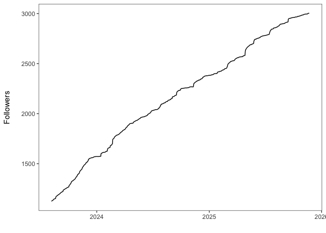
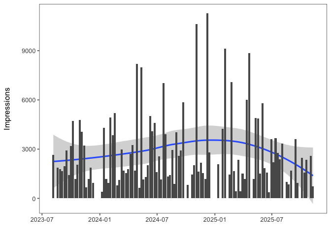
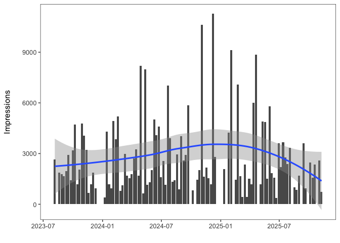
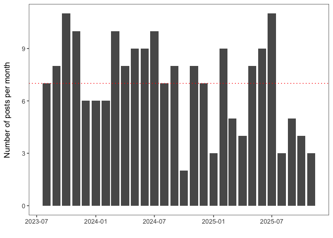

# GHE on LinkedIn


``` r
followers |>
  ggplot(aes(x = date, y = cumulative_followers)) +
  geom_line() +
  labs(
    x = "",
    y = "Followers\n"
  ) +
    theme_few()
```



``` r
content_overview %>%
  group_by(month = floor_date(date, "week")) %>%
  summarise(
    sum_value = sum(likes, na.rm = TRUE),
    mean_value = mean(likes, na.rm = TRUE),
    .groups = "drop"
  ) |>
  ggplot(aes(x = month, y = sum_value)) +
  geom_col() +
  geom_smooth() +
  labs(
    x = "",
    y = "Likes\n"
  ) +
  theme_few()
```



``` r
# impressions over time
content_overview %>%
  group_by(month = floor_date(date, "week")) %>%
  summarise(
    sum_value = sum(impressions, na.rm = TRUE),
    mean_value = mean(impressions, na.rm = TRUE),
    .groups = "drop"
  ) |>
  ggplot(aes(x = month, y = sum_value)) +
  geom_col() +
  geom_smooth() +
  labs(
    x = "",
    y = "Impressions\n"
  ) +
  theme_few()
```



``` r
mean_n_posts  <- content_overview %>%
  group_by(month = floor_date(date, "month")) %>%
  count() |> 
  ungroup() |> 
  summarise(mean_posts = mean(n)) |> 
  pull()

content_overview %>%
  group_by(month = floor_date(date, "month")) %>%
  count() |> 
  ggplot(aes(x = month, y = n)) +
  geom_col() +
  geom_hline(yintercept = mean_n_posts, color = "red", linetype = "dotted") +
  labs(
    x = "",
    y = "Number of posts per month\n"
  ) +
  theme_few()
```



## Top 5: Likes

``` r
# filter top 10 posts according to likes
content_posts |> 
  slice_max(likes, n = 5) |> 
  select(post_title, likes) |> 
  knitr::kable(format = "html")
```

<div>

| post_title                                                                                                                                                                                                                                                                                                                                                                                                                                                                                                                                                                                            | likes |
|:------------------------------------------------------------------------------------------------------------------------------------------------------------------------------------------------------------------------------------------------------------------------------------------------------------------------------------------------------------------------------------------------------------------------------------------------------------------------------------------------------------------------------------------------------------------------------------------------------|------:|
| We're excited to host Hope kelvin Chilunga at our group for the next six weeks! 🚀 During his stay, he will write his ETH for Development - ETH4D PhD proposal, focusing on how remote sensing can be leveraged to detect burning waste sites and their emissions. Hope holds a Master in 🤖 and Artificial Intelligence, is a lecturer at Malawi University of Business and Applied Sciences- MUBAS and runs his own drone company in Malawi 🇲🇼. Make sure to catch him while he's here to share his insights on the latest advancements in drone technology or to discuss future collaborations! 🤝 |   243 |
| 🎉🎉 We’re pleased to introduce Padraic Casserly, our new PhD student! 🎉🎉 Padraic is an experienced global health engineer, with years of experience implementing developmental projects in Sub-Saharan Africa. For his research he will work with partners in Malawi 🇲🇼 to optimize low-cost biogas systems 🔥 and deliver renewable energy ♻️ and sanitation solutions 🚽, directly contributing to Switzerland's carbon reduction and international development goals ✅                                                                                                                         |   218 |
| Master student Teymour D'Andrea is working to build better, cheaper, stronger toilets in South Africa with Antoinette van der Merwe and the NGO Nova Institute NPC. We are grateful to funding from ETH for Development - ETH4D.                                                                                                                                                                                                                                                                                                                                                                      |   166 |
| We welcome with open arms Prof. Azadeh Kermanshahi-pour, PhD, P.Eng from Dalhousie University for a 6-month sabbatical at GHE. As a biogas, anaerobic digestion, and ressource recovery expert, her invaluable expertise will enhance our current and future projects. Excited for the innovations ahead in sustainable energy and waste management!                                                                                                                                                                                                                                                  |   161 |
| 🚀 Meet the dream team! ✨ Last week in \#Blantyre, \#Malawi we had the chance to meet up with our long time friends and collaborators. From L-R: Elizabeth Tilley, Wrixon Mpanang'ombe, Jonathan Kwangulero, Hope kelvin Chilunga, Lin Boynton, Doreen Ndovie, Sally Changaya.                                                                                                                                                                                                                                                                                                                       |   137 |

</div>

## Top 5: Reposts

``` r
# filter top 10 posts according to likes
content_posts |> 
  slice_max(reposts, n = 5) |> 
  select(post_title, reposts) |> 
  knitr::kable(format = "html")
```

<div>

| post_title                                                                                                                                                                                                                                                                                                                                                                                                                                                                                                                                                                                                                                                                                                                                                                                                                                                                                                                                                                                                                                                                             | reposts |
|:---------------------------------------------------------------------------------------------------------------------------------------------------------------------------------------------------------------------------------------------------------------------------------------------------------------------------------------------------------------------------------------------------------------------------------------------------------------------------------------------------------------------------------------------------------------------------------------------------------------------------------------------------------------------------------------------------------------------------------------------------------------------------------------------------------------------------------------------------------------------------------------------------------------------------------------------------------------------------------------------------------------------------------------------------------------------------------------|--------:|
| 🎓✨ Free 9-Week Data Science Programme – 💧🧑‍💻 Data Science for openwashdata - 002 is here! We're doing it again! Two years after our first iteration, we're running the "data science for openwashdata" course again. The course content will largely stay the same with a few distinct differences: - We will provide recordings of the live lectures, but expect you to complete a new homework quiz within two weeks after the lecture. - We will teach the bonus module: "Use of AI for coding support". - We are starting a mentorship programme for increased learning and support. - We offer language support for Spanish speakers. 🚀 You can't wait? Sign-up here (it will take you 15 minutes): https://lnkd.in/dzArwqMk 📚 You need more info? Find the course website here: https://lnkd.in/d76Nf9Tb 📊 You're interested in some statistics from the first iteration? Read Adriana Clavijo Daza's blog post: https://lnkd.in/dkhJ6bUi \#openwashdata \#WASH                                                                                                             |      25 |
| 🎓 openwashdata news 03 - academy 🎓 Are you a WASH professional? Do you want to learn data science with R? 📊 Then, sign up for our first "data science for openwashdata" course: https://lnkd.in/eA4jk8kS This is course is free and hosted on Zoom. We will meet 10 modules over 15 weeks. You will learn how to use R for your own data, and publish your results as stand-alone website to share it with the world. Learn more in our 3rd newsletter issue: https://lnkd.in/eM-crJ_e Your course instructors Lars Schöbitz and Mian Zhong are looking forward to meet you.                                                                                                                                                                                                                                                                                                                                                                                                                                                                                                        |      18 |
| 🚨 Job Alert 🚨 Do you love working with data? Do you love working with people that work with data? Then apply for our positions and become a data steward in Malawi or South Africa. Find job adverts here: - Malawi 🇲🇼 BASEflow Limited -\> apply: https://lnkd.in/dbThYRnH - SouthAfrica 🇿🇦 University of KwaZulu-Natal WASH R&D Centre -\> apply: https://lnkd.in/dw6djpEv You will be part of Phase 2 of our \#openwashdata projects funded by the Open Research Data Program of the ETH Board and work alongside Susan Mercer, Muthi Nhlema, Colin Walder, Yash Dubey, Elizabeth Tilley, Lars Schöbitz, and many others. We can't wait for your application and work with you on \#opendata and \#datastewardship for \#WASH.                                                                                                                                                                                                                                                                                                                                                    |      17 |
| We are hiring! 🎉 If you love sanitation, travel, and technology development, this could be for you! 💩 🇰🇪 🔬 https://lnkd.in/dw5pNGJw                                                                                                                                                                                                                                                                                                                                                                                                                                                                                                                                                                                                                                                                                                                                                                                                                                                                                                                                                 |      10 |
| We are urgently looking for a student willing to work on image classification for informal dump sites in South Africa! The work should adapt Random Forests or DNNs applied to images from Google Earth. We plan to quantify the total area and number of all dump sites in four of South Africa's Municipalities. All the details are available here: https://lnkd.in/dVS_4Pfu                                                                                                                                                                                                                                                                                                                                                                                                                                                                                                                                                                                                                                                                                                        |       9 |
| 🚀 Exciting Opportunity: Scientific Assistant - Data Science / Software Engineer at ETH Zürich! 🧪💻 Are you passionate about \#OpenScience and \#DataScience? Join our team at the Global Health Engineering group (Department of Mechanical and Process Engineering (D-MAVT), ETH Zurich)! We're looking for a talented individual to support our two ongoing projects funded by the Open Research Data Program of the ETH Board: (1) \#openwashdata community and (2) \#FAIR Data Practices for Qualitative Research in Transdisciplinarity. https://lnkd.in/dYs8C_YN 🔍 What we're looking for: - Proficiency in Git, GitHub, R, Python, RStudio IDE, VS Code - Expertise in R Tidyverse packages - Interest in use of Large Language Models (LLMs) in academia - Innovative thinker with a knack for process improvement - Early career professional seeking academic project experience 🌍 About us: We're a diverse, interdisciplinary team of 15 dedicated professionals working on resource-constrained countries. We value openness, creativity, and continuous improvement. |       9 |

</div>

## Top 5: Engagement Rate

``` r
content_posts |> 
  slice_max(engagement_rate, n = 5) |> 
  select(post_title, engagement_rate) |>
  arrange(desc(engagement_rate)) |>
  knitr::kable(format = "html")
```

<div>

| post_title                                                                                                                                                                                                                                                                                                                                                                                                                                                                                                                                                              | engagement_rate |
|:------------------------------------------------------------------------------------------------------------------------------------------------------------------------------------------------------------------------------------------------------------------------------------------------------------------------------------------------------------------------------------------------------------------------------------------------------------------------------------------------------------------------------------------------------------------------|----------------:|
| It’s a wrap on Day 1! After a series of insightful presentations on GHE statistics 📊 and inspiring talks from our talented PhD researchers 🎓, we ended the day on a creative note. In a 2-hour crafting workshop 🎨 Elizabeth Tilley brought everyone together to carve and print unique cards—an energizing way to close out a fantastic first day!                                                                                                                                                                                                                  |       0.7860963 |
| 🎨 Final exam... but make it ART! ✍️✨ For an extra 2 points, we challenged students in our MSc class 'International Engineering: from Hubris to Hope' to illustrate their favourite lecture—and they delivered! Who said learning can’t be fun, even in an exam? 🤓 🎭 also great feedback for us to learn what the main takeaways were for students. Swipe through the best illustrations & let us know—should this become a tradition? 👇 🎨 Can you spot Colin Colin Walder?                                                                                        |       0.6671059 |
| Our PhD student, Padraic Casserly, is currently in Mzuzu 🇲🇼 , busy setting up and testing various components of the newly installed biogas reactor. The goal of this installation is to evaluate the performance of biogas reactors under real-world conditions. 🧪 With the assistance of the two biogas operators, Mwai Kandaya and Esau Phiri, they are now conducting their initial pathogen tests. 🔬 Want to learn more about this project? You can find all our biogas-related research under the "Publications" tab on our website! 📚 https://lnkd.in/edNgGv6F |       0.3326572 |
| 🌟 Another productive week at GHE! Our team has been diving deep into ongoing projects here in Zurich 🇨🇭, while part of our crew is hard at work in Blantyre, Malawi. 🇲🇼 Here, we share the most fan-tastic moments of our week—reminding us that sometimes the best ideas come with a refreshing breeze! 😄 What’s your secret to staying cool while working hard? \#StayCool                                                                                                                                                                                          |       0.2902938 |
| When it's too hot in the office to work, it's best to just go llama trekking 🦙    https://www.yacana.ch/ (not a paid advertisement, just a good recommendation from us to you)                                                                                                                                                                                                                                                                                                                                                                                         |       0.2759022 |

</div>
