# GHE on ETH’s Research Collection


The [Research
Collection](https://library.ethz.ch/en/researching-and-publishing/publishing-and-registering/publishing-in-the-research-collection.html)
is ETH Zurich’s repository for publications and research data. It’s
where ETH Zurich faculty, staff and students can publish the full text
of their work or openly share their research data (open access). Since
the group was created in 2021, not only research staff of GHE but also
students have published their work (theses, software, etc.) on the
platform.

This README must be rendered with the following command in your
terminal: `quarto render analysis.qmd --to gfm --output README.md`

``` r
library(tidyverse)
library(ggthemes)
library(kableExtra)

overview  <- read_csv("raw-data/ghe-research-collection.csv")
monthly_visits  <- read_csv("raw-data/monthly_visits.csv") |> 
    mutate(date = parse_date_time(month, orders = "my"))
```

### Overview

``` r
paste0("Total publications: ", nrow(overview))
```

    [1] "Total publications: 119"

``` r
overview |> 
    group_by(publication_type) |> 
    count() |> 
    arrange(desc(n)) |>  
    kable(format = "html")
```

<div>

| publication_type      |   n |
|:----------------------|----:|
| Journal Article       |  39 |
| Master Thesis         |  22 |
| Bachelor Thesis       |  17 |
| Student Paper         |  17 |
| Dataset               |   5 |
| Other Research Data   |   5 |
| Report                |   5 |
| Other Publication     |   2 |
| Book Chapter          |   1 |
| Conference Poster     |   1 |
| Data Collection       |   1 |
| Model                 |   1 |
| Other Conference Item |   1 |
| Review Article        |   1 |
| Working Paper         |   1 |

</div>

### Number of publications

``` r
overview |> 
    group_by(year) |> 
    count() |> 
    ggplot(aes(x = year, y = n, label = n)) +
    geom_col() +
    geom_label() +
    labs(x = "",
    y = "Publications\n") +
        theme_few()
```

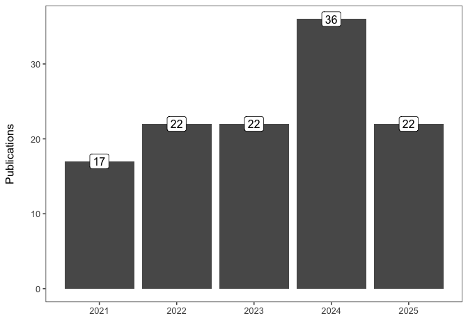

### Publication Types (absolute numbers)

``` r
overview |> 
    group_by(year, publication_type_group) |> 
    count() |> 
    ggplot(aes(x = year, y = n, fill = publication_type_group)) +
    geom_col(position = "stack") +
    labs(x = "",
    y = "Publications\n",
    fill = "Publication Type") +
        theme_few()
```

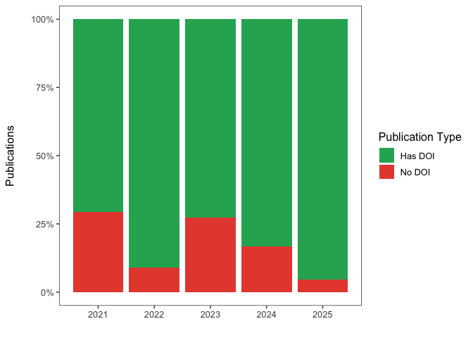

### Publication Types (relative numbers)

``` r
overview |> 
    group_by(year, publication_type_group) |> 
    count() |> 
    group_by(year) |> 
    mutate(rel_freq = n/sum(n))  |> 
    ggplot(aes(x = year, y = rel_freq, fill = publication_type_group)) +
    geom_col(position = "stack") +
    scale_y_continuous(labels = scales::label_percent()) +
    labs(x = "",
    y = "Share\n",
    fill = "Publication Type") +
        theme_few()
```

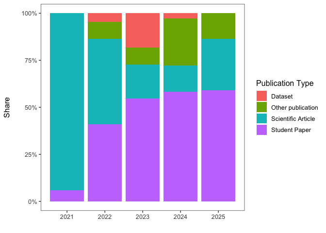

### Licenses

``` r
overview |> 
    group_by(year, license_short_group) |> 
    count() |> 
    ggplot(aes(x = year, y = n, fill = license_short_group)) +
    geom_col(position = "stack") +
    labs(x = "",
    y = "Publications\n",
    fill = "Publication Type") +
        theme_few()
```

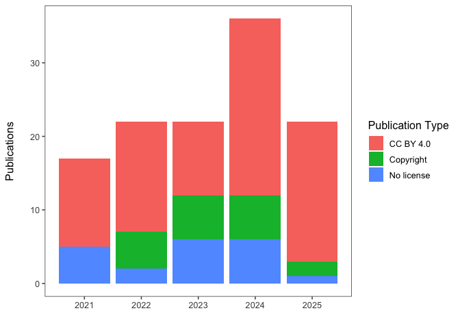

### DOIs

``` r
overview |> 
    group_by(year, doi_dummy) |> 
    count() |> 
    group_by(year) |> 
    mutate(rel_freq = n/sum(n))  |> 
    ggplot(aes(x = year, y = rel_freq, fill = doi_dummy)) +
    geom_col(position = "stack") +
    scale_y_continuous(labels = scales::label_percent()) +
    labs(x = "",
    y = "Publications\n",
    fill = "Publication Type") +
        theme_few()
```

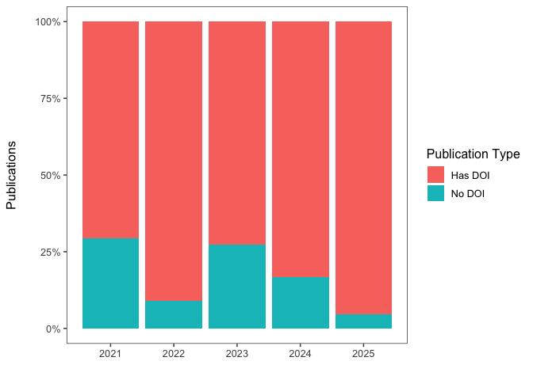

### Visits: Top 10

``` r
monthly_visits |> 
    group_by(title) |> 
    summarize(total_visits = sum(visits)) |> 
    arrange(desc(total_visits)) |> 
    slice_max(n = 10, order_by = total_visits) |> 
    kable(format = "html")
```

<div>

| title                                                                                                  | total_visits |
|:-------------------------------------------------------------------------------------------------------|-------------:|
| Land use in the Seychelles – Rethinking the Sustainability of Tourism                                  |          215 |
| Air quality monitoring from open waste and incinerator burning in Cape Maclear, Malawi                 |          181 |
| Plastic separation - A review                                                                          |          171 |
| Construction of a Glass Crusher and Evaluation of Waste Valorization Pathways for Cape Maclear, Malawi |          127 |
| Transforming Waste into Value: A Study on PET Recycling for Insulation Solutions in Malawi             |          116 |
| Design of an HDPE bottle collection and pre-cleaning system for recycling in Blantyre, Malawi          |          113 |
| Development of a Low-Cost Incinerator in Cape Maclear, Malawi                                          |          101 |
| Microcontroller Based Particulate Matter Monitors Utilising the Alphasense OPC-N3                      |          101 |
| Exploring Injection Molding for the Development of a Sensor Casings in Biogas Monitoring System        |           98 |
| Tipping aid for loading small trucks on waste collection tours                                         |           97 |

</div>

### Total Monthly Visits Over Time

``` r
monthly_visits |>
    group_by(date) |>
    summarize(total_visits = sum(visits)) |>
    ggplot(aes(x = date, y = total_visits)) +
    geom_line(size = 1, color = "#2c7fb8") +
    geom_point(size = 2, color = "#2c7fb8") +
    scale_x_date(date_labels = "%b %y",
        date_breaks = "1 month") +
    labs(x = "",
    y = "Total Visits\n",
    title = "Total Monthly Visits to Research Collection") +
    theme_few() +
    theme(axis.text.x = element_text(angle = 45, hjust = 1))
```

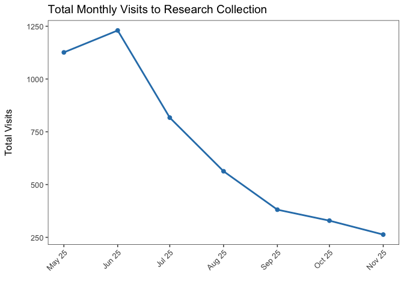

### Publication Type Distribution by License

``` r
overview |>
    group_by(publication_type_group, license_short_group) |>
    count() |>
    ggplot(aes(x = publication_type_group, y = n, fill = license_short_group)) +
    geom_col(position = "fill") +
    scale_y_continuous(labels = scales::label_percent()) +
    labs(x = "",
    y = "Share\n",
    fill = "License") +
    theme_few() +
    theme(axis.text.x = element_text(angle = 45, hjust = 1))
```

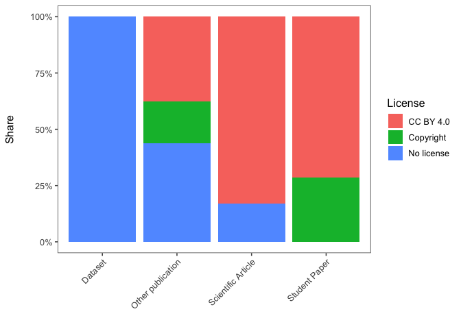

### Visits by Publication Type

``` r
monthly_visits |>
    left_join(overview |> select(name, publication_type_group), by = c("title" = "name")) |>
    filter(!is.na(publication_type_group)) |>
    group_by(publication_type_group) |>
    summarize(total_visits = sum(visits)) |>
    arrange(desc(total_visits)) |>
    ggplot(aes(x = reorder(publication_type_group, total_visits), y = total_visits, fill = publication_type_group)) +
    geom_col(show.legend = FALSE) +
    coord_flip() +
    labs(x = "",
    y = "\nTotal Visits",
    title = "Total Visits by Publication Type") +
    theme_few()
```

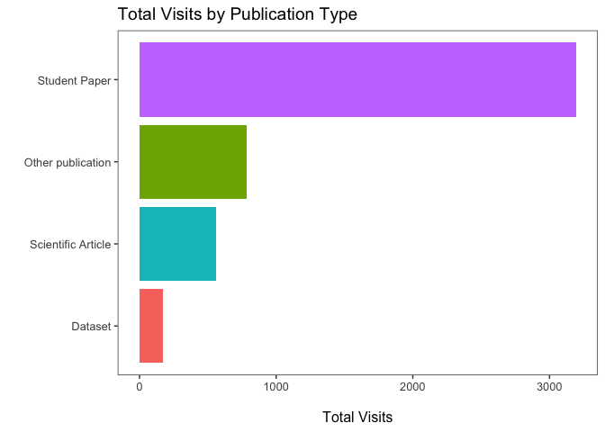

### Visits: Individual items

``` r
monthly_visits |>
    filter(title == "Life cycle assessment of household biogas digesters: A preliminary study on emissions and system interdependencies") |>
    ggplot(aes(x = date, y = visits)) +
    geom_col() +
    scale_x_date(date_labels = "%b %y",
        date_breaks = "1 month") +
    labs(x = "",
    y = "Visits\n",
    title = "Life cycle assessment of household biogas digesters: A preliminary study on emissions and system interdependencies") +
        theme_few()
```

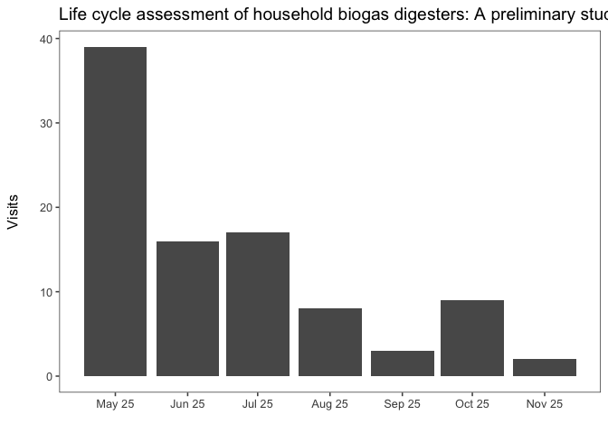

``` r
monthly_visits |>
    filter(title == "Land use in the Seychelles – Rethinking the Sustainability of Tourism") |>
    ggplot(aes(x = date, y = visits)) +
    geom_col() +
    scale_x_date(date_labels = "%b %y",
        date_breaks = "1 month") +
    labs(x = "",
    y = "Visits\n",
    title = "Land use in the Seychelles – Rethinking the Sustainability of Tourism") +
        theme_few()
```

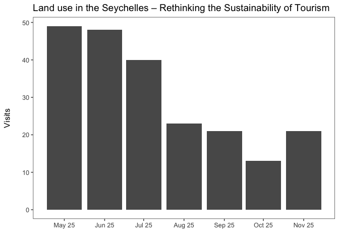

``` r
monthly_visits |>
    filter(title == "Air quality monitoring from open waste and incinerator burning in Cape Maclear, Malawi") |>
    ggplot(aes(x = date, y = visits)) +
    geom_col() +
    scale_x_date(date_labels = "%b %y",
        date_breaks = "1 month") +
    labs(x = "",
    y = "Visits\n",
    title = "Air quality monitoring from open waste and incinerator burning in Cape Maclear, Malawi") +
        theme_few()
```

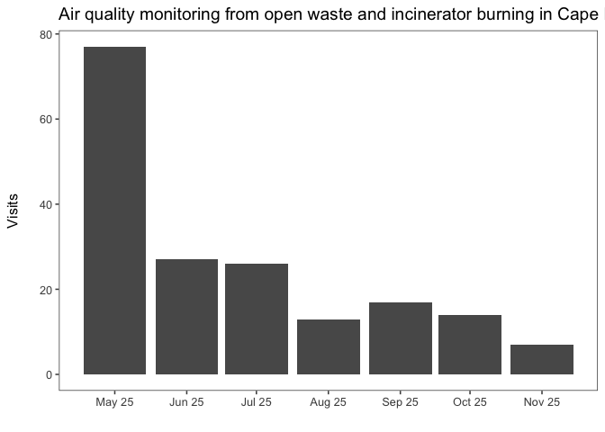

``` r
monthly_visits |>
    filter(title == "Plastic separation - A review") |>
    ggplot(aes(x = date, y = visits)) +
    geom_col() +
    scale_x_date(date_labels = "%b %y",
        date_breaks = "1 month") +
    labs(x = "",
    y = "Visits\n",
    title = "Plastic separation - A review") +
        theme_few()
```

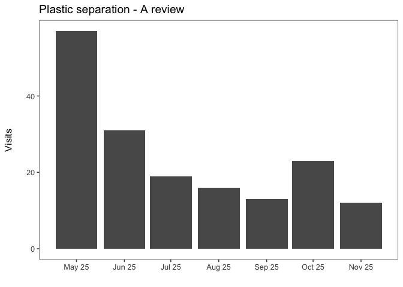
