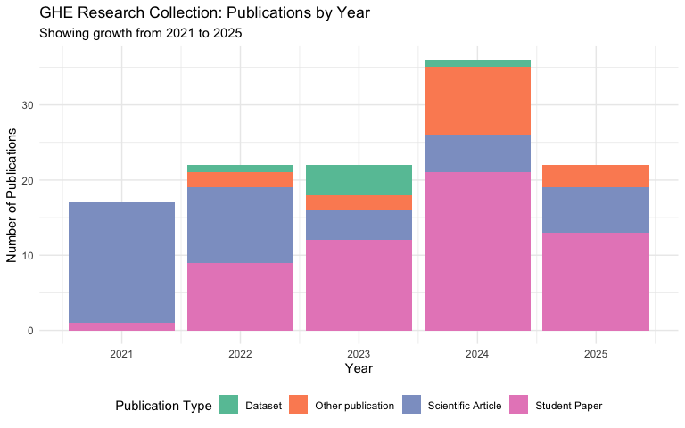
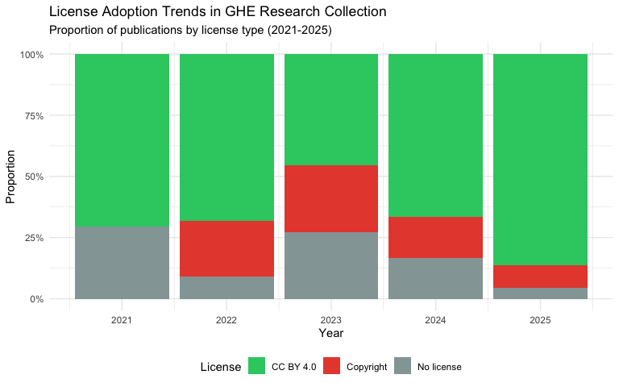
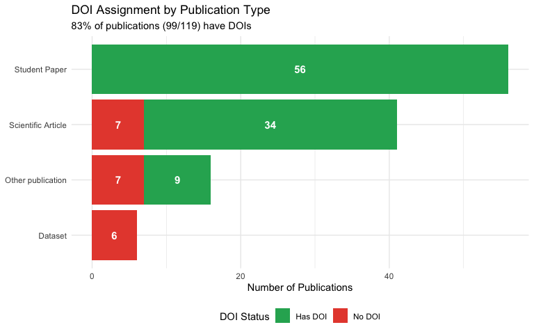
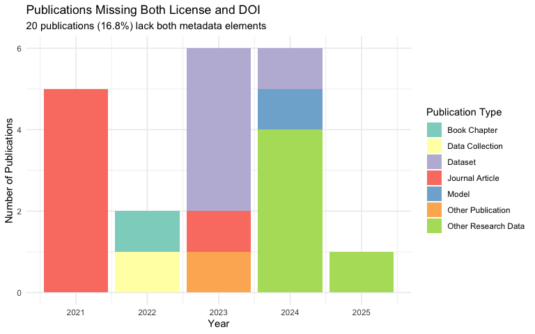
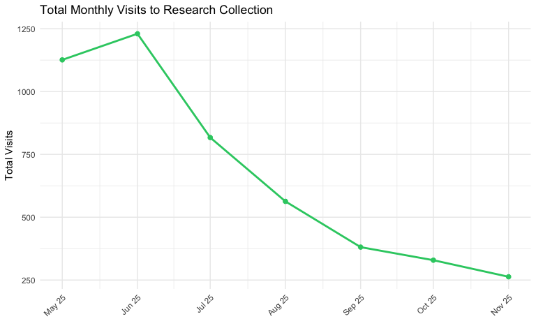
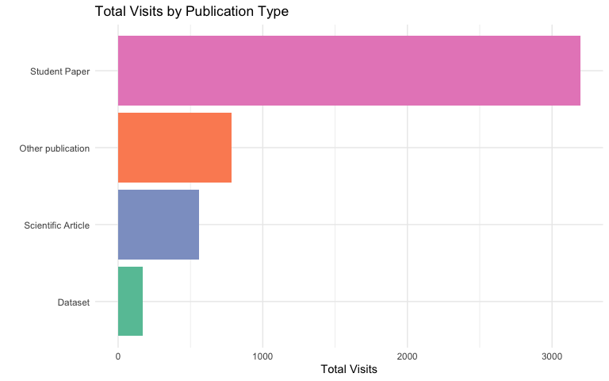

# GHE Research Collection: Publication Patterns Analysis
GHE Open Science Team
2025-12-09

## Overview

The [Research
Collection](https://library.ethz.ch/en/researching-and-publishing/publishing-and-registering/publishing-in-the-research-collection.html)
is ETH Zurich’s repository for publications and research data. It’s
where ETH Zurich faculty, staff and students can publish the full text
of their work or openly share their research data (open access). Since
the group was created in 2021, not only research staff of GHE but also
students have published their work (theses, software, etc.) on the
platform.

This report analyzes publication patterns in the GHE Research
Collection, examining trends in publication types, open access
licensing, DOI adoption, and temporal patterns across 119 publications
from 2021 to 2025.

This README must be rendered with the following command in your
terminal: `quarto render analysis.qmd --to gfm --output README.md`

## Data Loading

``` r
library(tidyverse)
library(kableExtra)
library(ggthemes)

# Read in the GHE research collection data
ghe_research_collection <- read_csv("raw-data/ghe-research-collection.csv")
monthly_visits <- read_csv("raw-data/monthly_visits.csv") |>
  mutate(date = parse_date_time(month, orders = "my"))
```

## Dataset Overview

``` r
paste0("Total publications: ", nrow(ghe_research_collection))
```

    [1] "Total publications: 119"

``` r
ghe_research_collection |> 
    group_by(publication_type) |> 
    count() |> 
    arrange(desc(n)) |>  
    kable(format = "html")
```

<div>

| publication_type      |   n |
|:----------------------|----:|
| Journal Article       |  39 |
| Master Thesis         |  22 |
| Bachelor Thesis       |  17 |
| Student Paper         |  17 |
| Dataset               |   5 |
| Other Research Data   |   5 |
| Report                |   5 |
| Other Publication     |   2 |
| Book Chapter          |   1 |
| Conference Poster     |   1 |
| Data Collection       |   1 |
| Model                 |   1 |
| Other Conference Item |   1 |
| Review Article        |   1 |
| Working Paper         |   1 |

</div>

### Number of publications

``` r
ghe_research_collection |> 
    group_by(year) |> 
    count() |> 
    ggplot(aes(x = year, y = n, label = n)) +
    geom_col() +
    geom_label() +
    labs(x = "",
    y = "Publications\n") +
        theme_few()
```


## Publication Growth and Composition

``` r
ghe_research_collection |>
  count(year, publication_type_group) |>
  ggplot(aes(x = year, y = n, fill = publication_type_group)) +
  geom_col() +
  labs(
    title = "GHE Research Collection: Publications by Year",
    subtitle = "Showing growth from 2021 to 2025",
    x = "Year",
    y = "Number of Publications",
    fill = "Publication Type"
  ) +
  theme_minimal() +
  scale_fill_brewer(palette = "Set2") +
  theme(legend.position = "bottom")
```



### Publication Types (relative numbers)

``` r
ghe_research_collection |> 
    group_by(year, publication_type_group) |> 
    count() |> 
    group_by(year) |> 
    mutate(rel_freq = n/sum(n))  |> 
    ggplot(aes(x = year, y = rel_freq, fill = publication_type_group)) +
    geom_col(position = "stack") +
    scale_y_continuous(labels = scales::label_percent()) +
    labs(x = "",
    y = "Share\n",
    fill = "Publication Type") +
    scale_fill_brewer(palette = "Set2") +
    theme_few()
```


### Publication Type Distribution

``` r
ghe_research_collection |>
  count(publication_type_group, sort = TRUE) |>
  rename(
    `Publication Type Group` = publication_type_group,
    `Count` = n
  ) |>
  mutate(Percentage = round(100 * Count / sum(Count), 1)) |>
  knitr::kable()
```

| Publication Type Group | Count | Percentage |
|:-----------------------|------:|-----------:|
| Student Paper          |    56 |       47.1 |
| Scientific Article     |    41 |       34.5 |
| Other publication      |    16 |       13.4 |
| Dataset                |     6 |        5.0 |

Student papers (including Bachelor and Master theses) represent
**47.1%** of the collection, followed by scientific articles at
**34.5%**.

## Open Access Licensing Trends

``` r
ghe_research_collection |>
  count(year, license_short_group) |>
  ggplot(aes(x = year, y = n, fill = license_short_group)) +
  geom_col(position = "fill") +
  labs(
    title = "License Adoption Trends in GHE Research Collection",
    subtitle = "Proportion of publications by license type (2021-2025)",
    x = "Year",
    y = "Proportion",
    fill = "License"
  ) +
  scale_y_continuous(labels = scales::percent) +
  theme_minimal() +
  scale_fill_manual(
    values = c(
      "CC BY 4.0" = "#2ecc71",
      "Copyright" = "#e74c3c",
      "No license" = "#95a5a6",
      "CC BY-NC 4.0" = "#f39c12",
      "CC BY-NC-ND 4.0" = "#e67e22",
      "CC BY-NC-SA 4.0" = "#d35400"
    )
  ) +
  theme(legend.position = "bottom")
```



### License Distribution Over Time

``` r
ghe_research_collection |>
  count(year, license_short_group) |>
  pivot_wider(names_from = license_short_group, values_from = n, values_fill = 0) |>
  mutate(
    Total = rowSums(across(-year)),
    `% CC BY 4.0` = round(100 * `CC BY 4.0` / Total, 1)
  ) |>
  knitr::kable()
```

| year | CC BY 4.0 | No license | Copyright | Total | % CC BY 4.0 |
|-----:|----------:|-----------:|----------:|------:|------------:|
| 2021 |        12 |          5 |         0 |    17 |        70.6 |
| 2022 |        15 |          2 |         5 |    22 |        68.2 |
| 2023 |        10 |          6 |         6 |    22 |        45.5 |
| 2024 |        24 |          6 |         6 |    36 |        66.7 |
| 2025 |        19 |          1 |         2 |    22 |        86.4 |

CC BY 4.0 adoption has increased from **70.6%** in 2021 to **86.4%** in
2025.

## DOI Assignment Patterns

``` r
ghe_research_collection |>
  count(publication_type_group, doi_dummy) |>
  ggplot(aes(x = reorder(publication_type_group, n, sum), y = n, fill = doi_dummy)) +
  geom_col(position = "stack") +
  geom_text(
    aes(label = n),
    position = position_stack(vjust = 0.5),
    color = "white",
    fontface = "bold",
    size = 4
  ) +
  coord_flip() +
  labs(
    title = "DOI Assignment by Publication Type",
    subtitle = "83% of publications (99/119) have DOIs",
    x = NULL,
    y = "Number of Publications",
    fill = "DOI Status"
  ) +
  theme_minimal() +
  scale_fill_manual(values = c("Has DOI" = "#27ae60", "No DOI" = "#e74c3c")) +
  theme(legend.position = "bottom")
```



### DOI Adoption by Year

``` r
ghe_research_collection |> 
    group_by(year, doi_dummy) |> 
    count() |> 
    group_by(year) |> 
    mutate(rel_freq = n/sum(n))  |> 
    ggplot(aes(x = year, y = rel_freq, fill = doi_dummy)) +
    geom_col(position = "stack") +
    scale_y_continuous(labels = scales::label_percent()) +
    labs(x = "",
    y = "Publications\n",
    fill = "Publication Type") +
    scale_fill_manual(values = c("Has DOI" = "#27ae60", "No DOI" = "#e74c3c")) +    
    theme_few()
```


``` r
ghe_research_collection |>
  count(year, doi_dummy) |>
  pivot_wider(names_from = doi_dummy, values_from = n, values_fill = 0) |>
  mutate(
    Total = `Has DOI` + `No DOI`,
    `% with DOI` = round(100 * `Has DOI` / Total, 1)
  ) |>
  knitr::kable()
```

| year | Has DOI | No DOI | Total | % with DOI |
|-----:|--------:|-------:|------:|-----------:|
| 2021 |      12 |      5 |    17 |       70.6 |
| 2022 |      20 |      2 |    22 |       90.9 |
| 2023 |      16 |      6 |    22 |       72.7 |
| 2024 |      30 |      6 |    36 |       83.3 |
| 2025 |      21 |      1 |    22 |       95.5 |

**Key observations:**

- Overall DOI adoption: **83.2%**
- Strong improvement: from **70.6%** in 2021 to **95.5%** in 2025
- **All student papers have DOIs** (56/56), demonstrating excellent
  metadata practices
- **Datasets have the lowest DOI adoption**: all 6 datasets currently
  lack DOIs

## Identifying Metadata Gaps

### Publications Without Licenses

``` r
no_license <- ghe_research_collection |>
  filter(license_short == "No license")

cat("Publications without license:", nrow(no_license), "out of", nrow(ghe_research_collection), "\n")
```

    Publications without license: 20 out of 119 

### Publications Without DOIs

``` r
no_doi <- ghe_research_collection |>
  filter(doi_dummy == "No DOI")

cat("Publications without DOI:", nrow(no_doi), "out of", nrow(ghe_research_collection), "\n")
```

    Publications without DOI: 20 out of 119 

### The Complete Overlap

``` r
overlap_count <- sum(ghe_research_collection$license_short == "No license" & 
                     ghe_research_collection$doi_dummy == "No DOI")

cat("Publications missing BOTH license AND DOI:", overlap_count, "\n")
```

    Publications missing BOTH license AND DOI: 20 

``` r
cat("This represents 100% of publications without licenses\n")
```

    This represents 100% of publications without licenses

``` r
cat("and 100% of publications without DOIs.\n")
```

    and 100% of publications without DOIs.

> [!WARNING]
>
> ### Metadata Gap Alert
>
> **20 publications (16.8%)** lack both license information and DOIs.
> This represents a systematic metadata gap that affects the same set of
> publications.

### Visualizing the Metadata Gap

``` r
ghe_research_collection |>
  filter(license_short == "No license" & doi_dummy == "No DOI") |>
  count(publication_type, year) |>
  ggplot(aes(x = year, y = n, fill = publication_type)) +
  geom_col() +
  labs(
    title = "Publications Missing Both License and DOI",
    subtitle = "20 publications (16.8%) lack both metadata elements",
    x = "Year",
    y = "Number of Publications",
    fill = "Publication Type"
  ) +
  theme_minimal() +
  scale_fill_brewer(palette = "Set3") +
  theme(legend.position = "right")
```



The perfect correlation between missing licenses and missing DOIs
suggests these are not random omissions but rather a systematic gap in
the metadata collection workflow. Student papers show exemplary metadata
practices (100% DOI coverage), suggesting the workflow for datasets and
some journal articles may need improvement.

## Research Impact and Engagement

Beyond publication metadata, analyzing how research is discovered and
accessed provides insights into impact. This section examines visitor
patterns across the collection.

### Top 10 Most Visited Publications

``` r
monthly_visits |>
  group_by(title) |>
  summarize(total_visits = sum(visits)) |>
  arrange(desc(total_visits)) |>
  slice_max(n = 10, order_by = total_visits) |>
  knitr::kable()
```

| title                                                                                                  | total_visits |
|:-------------------------------------------------------------------------------------------------------|-------------:|
| Land use in the Seychelles – Rethinking the Sustainability of Tourism                                  |          215 |
| Air quality monitoring from open waste and incinerator burning in Cape Maclear, Malawi                 |          181 |
| Plastic separation - A review                                                                          |          171 |
| Construction of a Glass Crusher and Evaluation of Waste Valorization Pathways for Cape Maclear, Malawi |          127 |
| Transforming Waste into Value: A Study on PET Recycling for Insulation Solutions in Malawi             |          116 |
| Design of an HDPE bottle collection and pre-cleaning system for recycling in Blantyre, Malawi          |          113 |
| Development of a Low-Cost Incinerator in Cape Maclear, Malawi                                          |          101 |
| Microcontroller Based Particulate Matter Monitors Utilising the Alphasense OPC-N3                      |          101 |
| Exploring Injection Molding for the Development of a Sensor Casings in Biogas Monitoring System        |           98 |
| Tipping aid for loading small trucks on waste collection tours                                         |           97 |

### Total Monthly Visits Over Time

``` r
monthly_visits |>
  group_by(date) |>
  summarize(total_visits = sum(visits)) |>
  ggplot(aes(x = date, y = total_visits)) +
  geom_line(linewidth = 1, color = "#2ecc71") +
  geom_point(size = 2, color = "#2ecc71") +
  scale_x_date(date_labels = "%b %y", date_breaks = "1 month") +
  labs(
    x = "",
    y = "Total Visits",
    title = "Total Monthly Visits to Research Collection"
  ) +
  theme_minimal() +
  theme(axis.text.x = element_text(angle = 45, hjust = 1))
```



### Visits by Publication Type

``` r
monthly_visits |>
  left_join(ghe_research_collection |> select(name, publication_type_group), 
            by = c("title" = "name")) |>
  filter(!is.na(publication_type_group)) |>
  group_by(publication_type_group) |>
  summarize(total_visits = sum(visits)) |>
  arrange(desc(total_visits)) |>
  ggplot(aes(x = reorder(publication_type_group, total_visits), y = total_visits, 
             fill = publication_type_group)) +
  geom_col(show.legend = FALSE) +
  scale_fill_brewer(palette = "Set2") +
  coord_flip() +
  labs(
    x = "",
    y = "Total Visits",
    title = "Total Visits by Publication Type"
  ) +
  theme_minimal()
```



## Key Findings

### 1. Publication Growth & Composition

- The collection has grown from **17** publications in 2021 to **36** in
  2024
- Student work dominates (**56 out of 119 = 47.1%**), including Master
  theses, Bachelor theses, and student papers
- Journal articles are the single largest type (**39 publications,
  32.8%**)

### 2. Open Access Adoption is Strong

- **~70-86% of publications use CC BY 4.0** (the most permissive
  Creative Commons license) across all years
- Positive trend: 2025 shows **86.4%** CC BY 4.0 adoption vs. 70.6% in
  2021
- “Copyright” and “No license” publications are decreasing
  proportionally over time

### 3. DOI Assignment Patterns

- Overall **83.2%** have DOIs (99 out of 119)
- Strong improvement over time: from 70.6% in 2021 to **95.5%** in 2025
- All student papers have DOIs, showing excellent metadata practices
- **Datasets represent a gap**: none of the 6 datasets have DOIs

### 4. Systematic Metadata Gap Identified

- **20 publications (16.8%) lack both license AND DOI** - a 100% overlap
- These are primarily datasets (11/20, 55%) and journal articles (6/20,
  30%)
- **Zero student papers** have this metadata gap, indicating different
  workflows
- This suggests a systematic issue in metadata collection for certain
  publication types

### 5. Diverse Publication Types

- **15** different publication types, but dominated by 4 main categories
- Good mix of research outputs: articles, theses, datasets, reports, and
  conference materials

### 6. Research Impact and Engagement

- Monthly visits show consistent engagement with the collection
- Top publications receive substantial visitor traffic, demonstrating
  research impact
- Student papers and scientific articles drive the majority of visits
- Open access publications (especially CC BY 4.0) benefit from greater
  visibility

## Conclusion

The GHE Research Collection demonstrates strong commitment to open
science principles, with high rates of open access licensing (CC BY 4.0)
and DOI adoption that have improved significantly from 2021 to 2025.
Student work forms the backbone of the collection, and the excellent
metadata practices applied to these publications serve as a model for
the entire collection.

However, a systematic metadata gap has been identified: 20 publications
(16.8%) lack both licenses and DOIs, primarily affecting datasets and
some journal articles. This 100% overlap suggests a workflow issue
rather than random omissions. Addressing this gap—particularly for
datasets—would significantly enhance the collection’s discoverability
and compliance with FAIR data principles.

The collection’s visitor patterns show that research published with
proper open access licensing and metadata attracts sustained engagement,
underscoring the value of comprehensive metadata practices for research
impact.
